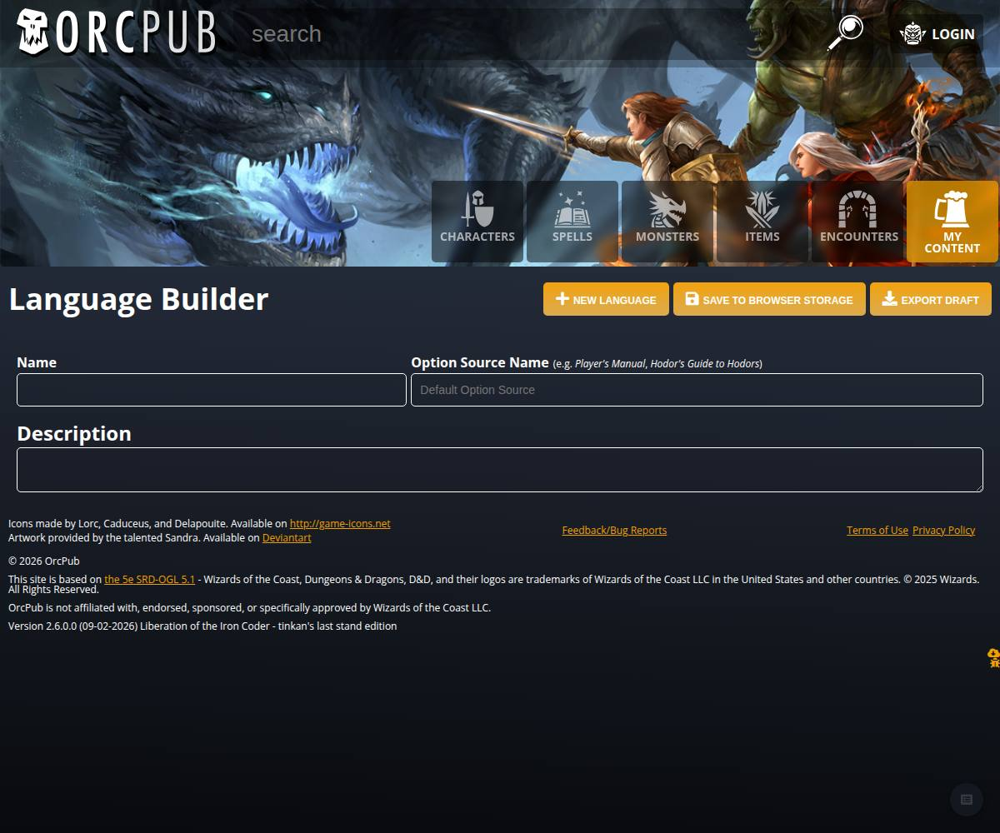
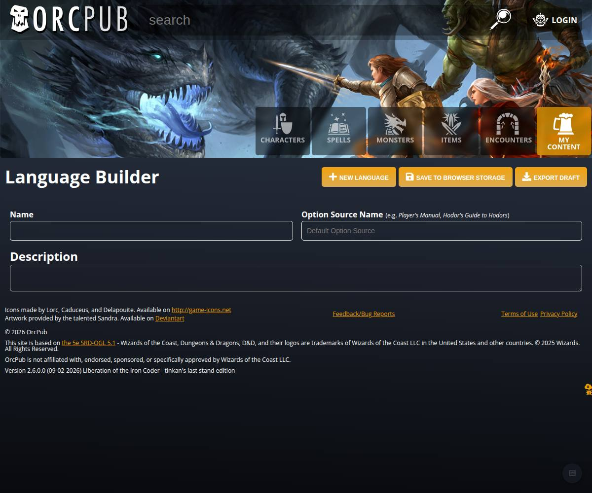
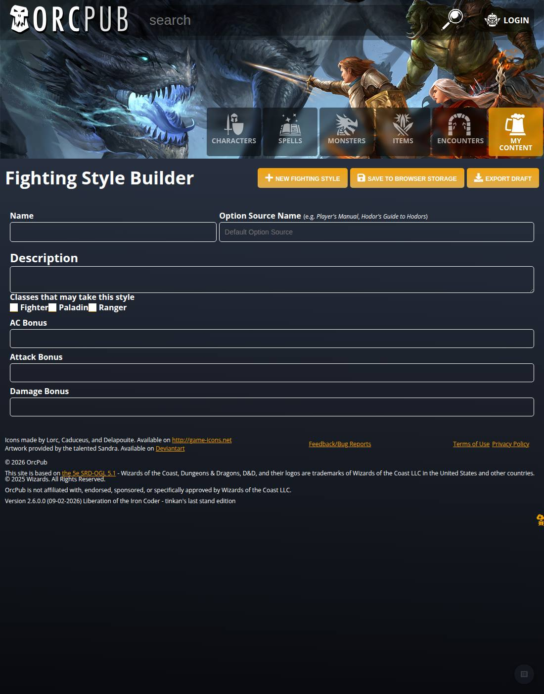
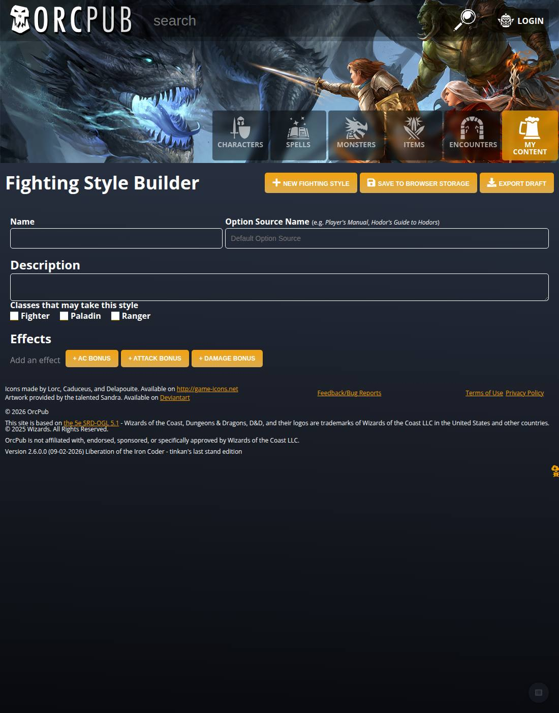
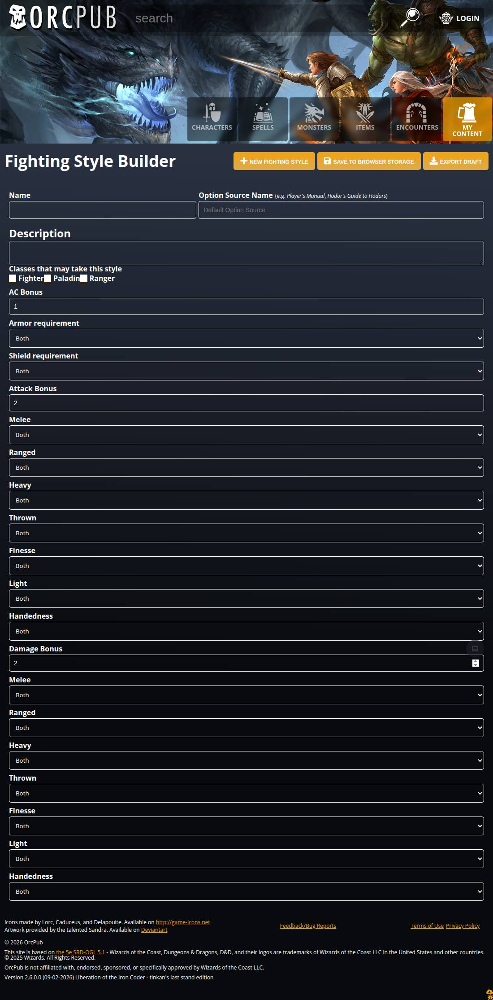
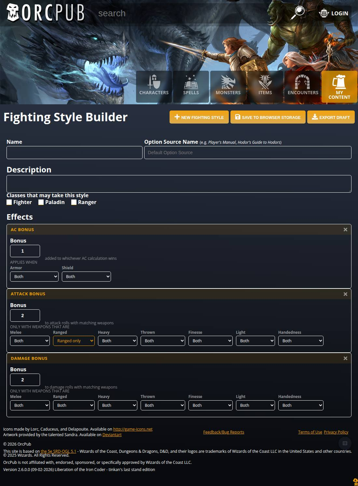
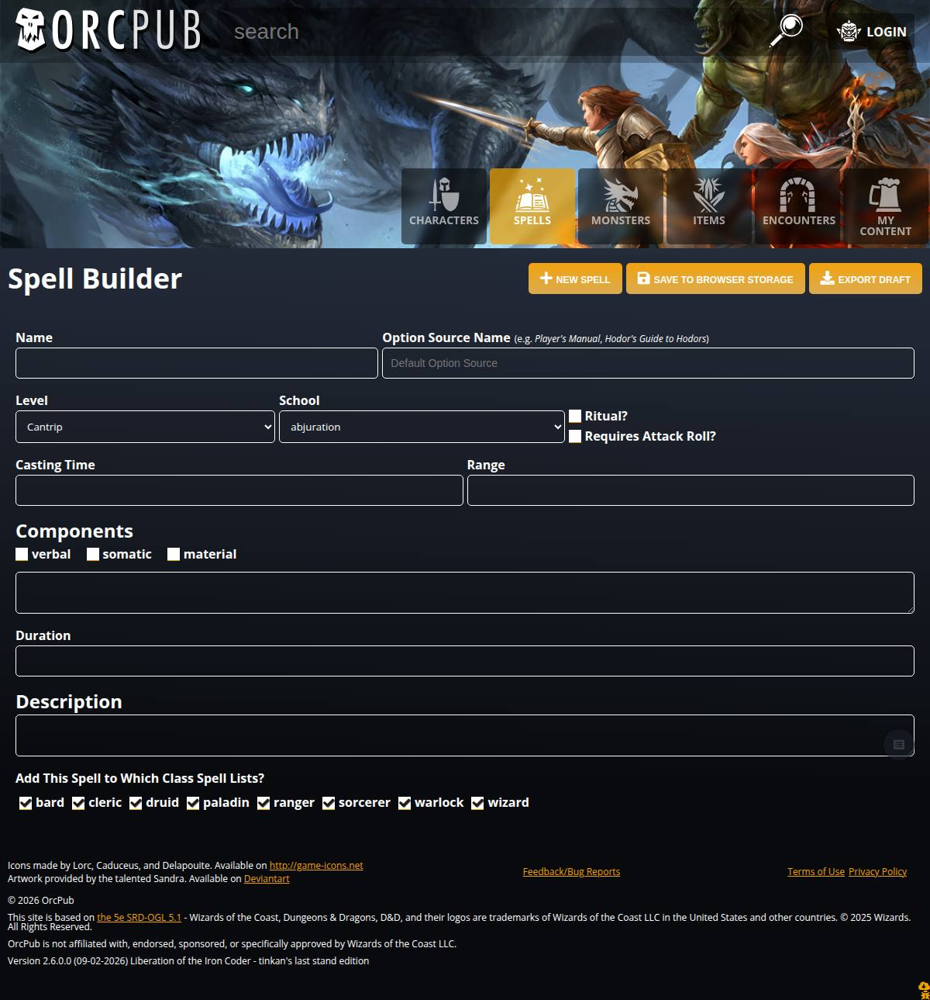
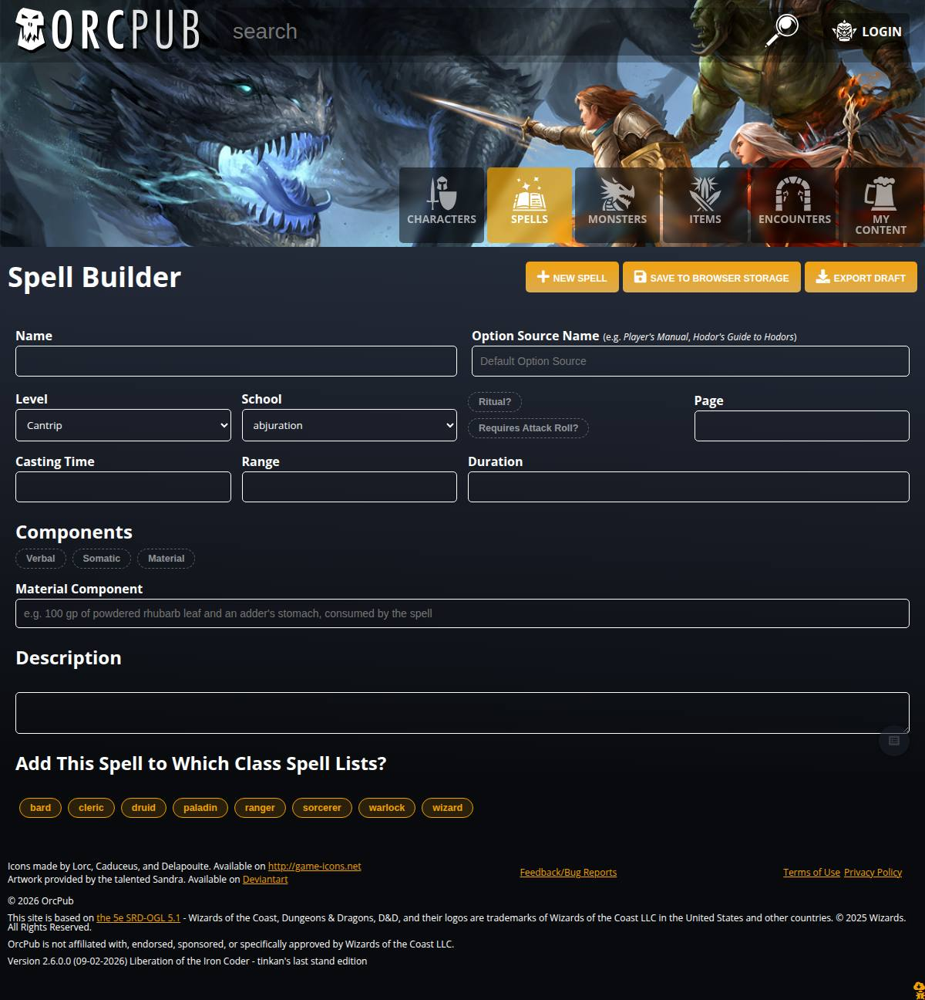
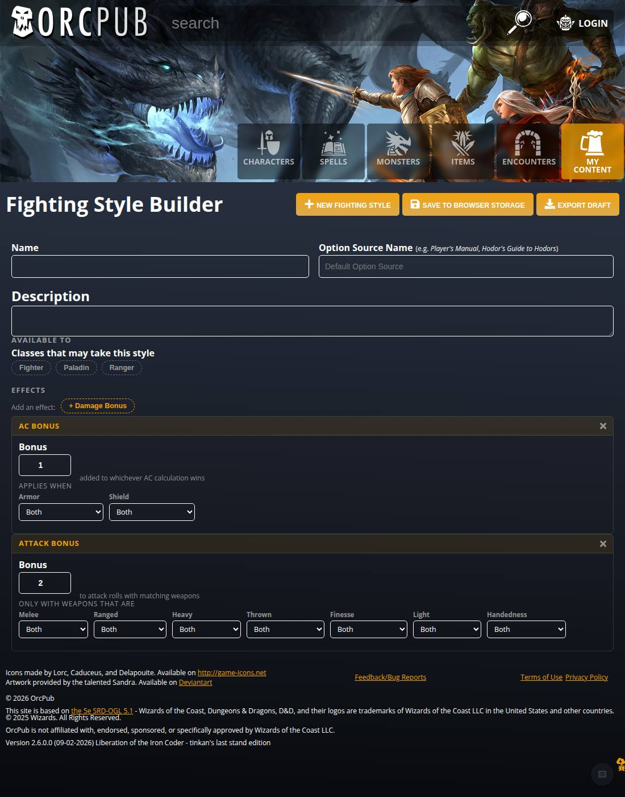
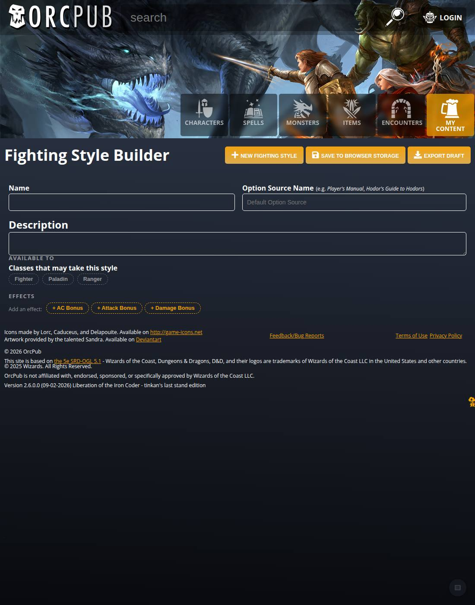

# Builder conversion gallery — the bespoke form, and the one that replaced it

**What this is.** Side-by-side pictures and code for each builder form that has been converted from
hand-written hiccup to a declarative schema, plus the measurements that say whether the conversion
was actually an improvement. Every image is the **real app** — `lein e2e-server`, the real route,
the real widgets — captured by a script, not a mockup.

**Reproduce any picture here:**

```bash
lein fig:build && lein garden once && lein e2e-server      # port 8890
LABEL=after node test/e2e/builder-gallery.js               # every builder page
LABEL=after node test/e2e/form-shape-comparison.js         # one builder, authored, with metrics
node test/e2e/mockup-parity.js                            # shipped form vs the approved mockup
```

To photograph a *previous* shape, put the old files back, rebuild, shoot, restore:

```bash
for f in src/cljs/orcpub/dnd/e5/views.cljs src/cljc/orcpub/dnd/e5/builder_fields.cljc \
         src/clj/orcpub/styles/core.clj; do
  cp "$f" "/tmp/$(basename $f).head"; git show <commit>:"$f" > "$f"
done
lein garden once && lein fig:build
LABEL=before node test/e2e/form-shape-comparison.js
for f in ...; do cp "/tmp/$(basename $f).head" "$f"; done && lein garden once && lein fig:build
```

**`git stash` is the trap here, not the tool.** Stashing only reaches back as far as your
uncommitted work; once the change is committed, stashing gives you the *new* shape and the capture
silently succeeds while photographing the wrong thing. That happened on the first attempt at this
page. Name the commit explicitly, and check the witness (below) before believing any pair.

---

## Pair 1 — Language builder (tier 1): 21 lines → 1

| bespoke (`492e2c32`) | generated (`2e91037d`) |
|---|---|
|  |  |

**The two JPEGs are byte-identical** — `cmp` reports no difference. Same fields, same order, same
spacing, same everything. That is the claim a tier-1 conversion should be able to make, and it is
checkable rather than asserted:

```bash
cmp docs/kb/assets/builder-comparison/language-bespoke.jpg \
    docs/kb/assets/builder-comparison/language-generated.jpg
```

**Why that is not a capture bug.** Identical output is exactly what a broken before/after capture
also produces — if the old build never went live, both shots are of the new one. So the "before"
run photographs a **witness page** alongside the subject: the fighting-style builder, which differs
sharply between the two commits (7 controls then, 4 now). It is committed here as
`witness-old-build-fighting-style.jpg`, and it differs from the same page in the after-gallery:

```bash
cmp docs/kb/assets/builder-comparison/witness-old-build-fighting-style.jpg \
    target/e2e-shots/gallery-after/fighting-style-builder.jpg      # differs -> old build was live
```

**Both frames are captured at the conversion commit (`2e91037d`), and HEAD no longer matches them.**
The later design pass gave the two head fields equal columns, which changes *every* generated
builder — see `language-current.jpg`. That is a deliberate change made after the conversion, not a
crack in the claim: the conversion changed nothing, and then something else deliberately did. The
pair stays pinned at the commit it is evidence for, because re-shooting it at HEAD would quietly
turn a proof into a picture.

| at the conversion (evidence above) | HEAD, after the design pass |
|---|---|
| unequal head columns, as the bespoke form had them |  |

### The code

```clojure
;; BEFORE — 19 lines of hiccup, plus a 2-line language-input-field with exactly one caller
(defn language-builder []
  (let [language @(subscribe [::langs/builder-item])]
    [:div.p-20.main-text-color
     [:div.flex.w-100-p.flex-wrap
      [language-input-field "Name" :name language "m-b-20"]
      [plugin-datalist option-source-name-label language ::langs/set-language-prop]]
     [:div.w-100-p
      [:div.f-s-24.f-w-b "Description"]
      [textarea-field
       {:value (get language :description)
        :on-change #(dispatch [::langs/set-language-prop :description %])}]]]))

;; AFTER
(defn language-builder []
  (simple-content-builder ::langs/builder-item ::langs/set-language-prop))
```

Nothing was designed for this. `simple-content-builder` already existed (June 2026) and `boon` and
`invocation` already used it; the language builder had simply never been pointed at it. **The
interesting part of a tier-1 conversion is not the diff, it is the procedure** — pin the *existing*
form with a test that asserts only observable behaviour, swap, run the same test. Both runs 12/12,
same saved item (`test/e2e/language-builder.js`).

---

## Pair 2 — Fighting Style builder (tier 2): flat fields → `:rows`

This is the one worth looking at, because it is where a declarative form stopped being merely
shorter and started being *better*.

### Empty

| flat | rows |
|---|---|
|  |  |

### The same style authored — +1 AC, +2 attack, +2 damage

| flat | rows |
|---|---|
|  |  |

Look at the middle of the flat form. **Melee, Ranged, Heavy, Thrown, Finesse, Light, Handedness —
each appears twice**, once for the attack bonus and once for the damage bonus, with nothing on
screen saying which is which. In the grouped form each sits inside a bordered group headed *Attack
Bonus* or *Damage Bonus*.

### Measured, not eyeballed

`test/e2e/form-shape-comparison.js` counts controls and ambiguous labels in both builds:

| | flat | rows |
|---|---:|---:|
| visible controls, empty form | 7 | **4** |
| visible controls, three effects authored | 23 | 23 |
| labels repeated with nothing distinguishing them | **7** | **0** |
| page height, authored | 2229px | **1493px** |

The fully-authored form has exactly the same 23 controls — grouping removes no fields — but it is
**736px shorter**, because inside a row a bonus gets a number's width and its tags sit inline
instead of each taking a page-wide row of its own — all seven weapon tags now fit on one line.

**The layout is a port of the approved mockup**, `assets/builder-form-mockup.html` — dashed pill
chips on the add-bar, an orange uppercase group header, a 92px centred bonus with its hint beside
it, and tags as `width:auto` selects under a muted sub-heading. The mockup is the design record and
`styles/core.clj` is its implementation.

**That claim is now checked, because asserting it by eye was wrong twice.** `test/e2e/mockup-parity.js`
renders the mockup and the real builder side by side, reads the computed style of each corresponding
element, and prints the differences. It is a **report, not a gate** — some divergence is correct, and
saying which is the design work. Two kinds are excluded by name:

- **mockup scaffolding** — `.panel`, `body`, the two-column layout. The mockup is a standalone page
  that had to draw its own idea of "the form area"; the real form area is the app page, and importing
  the panel would make this one builder unlike every other builder in the app.
- **app chrome** — input and select background/border come from the app's widget styles. The mockup
  approximated them; where they differ the app is right.

It found the thing that made the form look unfinished: **the group borders were solid white.**
`.b-1` sets the `border` shorthand with no colour, so it resets to `currentColor`, and it is declared
later in the stylesheet than any `border-color` a class of ours can set. The row owns its border now.

It also reports one difference that is the **mockup** being wrong, not the app: the bonus input reads
`font-weight: 400` there, because the mockup's own `input{font:inherit}` outranks its `.num{font-weight:700}`.
The app renders 700 — what the mockup meant. Do not "fix" the app to match a mockup bug.

**Short labels are why the tags fit.** The mockup writes *Armor*, not *Armor requirement*, and
*Ranged only*, not *Ranged weapons only* — under a header already reading ATTACK BONUS those words
are noise, and they are exactly what made each select page-wide. So a field may carry a
`:short-label`, and an option a `:short-title`, used **only** where it renders inside a group
(`:compact?`). The long form stays the default because these fragments are advertised as droppable
into any builder's flat `extra-fields`, where no header supplies the context. Both forms are pinned
by `short-forms-are-additions-not-replacements`; the `nil` ("Both") option deliberately has no
short form, since it must stay the explicit first option in every context.

**One thing in the mockup is deliberately not built: the `+ Reaction` chip.** A reaction is a
*trigger* ("when X happens, you may Y"), and triggers are sheet entries rather than computed
conditions — §4 of `builder-form-schemas.md`. The chip is missing because that vocabulary does not
exist yet, not because it was overlooked. When it lands it is one more entry in `:kinds`.

**The `set` highlight is the answer to "seven dropdowns all saying Both".** A tag carrying an
actual restriction is drawn in orange, so it reads at a glance against its unset neighbours — in
the shot above, *Ranged weapons only* against six *Both*s. The alternative considered was hiding
unset tags behind an "add a restriction" picker; it was **rejected** because it changes behaviour
to solve a visual problem, costs a click per restriction, and hides from the author the fact that
six other restrictions exist. Weight, not removal.

**Correction (same day).** The first version of this table read *2513px, 284px taller*, and the
paragraph here argued that the vertical cost was worth paying for unambiguous tags. That was
measuring a half-finished implementation: the grouping had shipped but the layout inside each group
had not, so every control was still a full-width stacked block. The number was real; the conclusion
drawn from it was wrong, and the fix was to finish the layout rather than to defend the cost. Left
in place because "the measurement said the change was worse and the answer was to do the change
properly" is the more useful lesson.

An "ambiguous label" is counted as a label repeated **within the same group** (the flat form's
labels are all in one implicit group). Two `Melee`s under two different titled rows are not
ambiguous and are not counted — the metric measures the defect, not the repetition.

### The code

```clojure
;; BEFORE — every field of every effect, concatenated flat
(simple-content-builder ::classes/fighting-style-builder-item
                        ::classes/set-fighting-style-prop
                        (concat bf/fighting-style-classes-field
                                bf/ac-bonus-fields
                                bf/attack-bonus-fields
                                bf/damage-bonus-fields))

;; AFTER
(simple-content-builder ::classes/fighting-style-builder-item
                        ::classes/set-fighting-style-prop
                        (concat bf/fighting-style-classes-field
                                (bf/effect-rows)))
```

and `effect-rows` is data — the same shared field fragments, unedited, arranged:

```clojure
[{:rows      :effects
  :title     "Effects"
  :add-label "Add an effect"
  :kinds     [{:kind :ac-bonus     :title "AC Bonus"     :at [:props :ac-bonus]
               :hint "added to whichever AC calculation wins"
               :tag-header "Applies when"
               :fields ac-bonus-fields}
              {:kind :attack-bonus :title "Attack Bonus" :at [:props :attack-bonus]
               :hint "to attack rolls with matching weapons"
               :tag-header "Only with weapons that are"
               :fields attack-bonus-fields}
              {:kind :damage-bonus :title "Damage Bonus" :at [:props :damage-bonus]
               :hint "to damage rolls with matching weapons"
               :tag-header "Only with weapons that are"
               :fields damage-bonus-fields}]}]

The row renders its lead by PATH (`:at` + `:bonus`) at a number's width with the hint beside it,
then the remaining fields as inline tags under `:tag-header`. The field fragments themselves are
untouched — the same `ac-bonus-fields` the flat forms in other builders still use.
```

**It is an arrangement, not a second storage model.** A row is "present" when the item has data
under its `:at` path, so nothing extra is stored to mark a row, an item authored by the old flat
form renders here unchanged, and the `.orcbrew` is untouched (D9). The e2e pins exactly that: a
bonus typed into a row lands at `:props {:ac-bonus {:bonus 1}}`, the same path as before.

### What the comparison caught in my own work

**Twice.** First, it reported `AC Bonus x2` as an ambiguous label in the **new** form: the row header said
*AC Bonus* and the number inside it said *AC Bonus* again. Fixed by relabelling the lead field to
*Bonus* — selected **by its path**, not its position, because the field fragments are shared with
other builders' flat forms and must not be edited for this one's benefit. The measurement earned its
place on its first run.

---

## Pair 3 — Spell builder: 86 lines → 12, and the first `:boolean`

| bespoke | generated |
|---|---|
|  |  |

Pinned by `test/e2e/spell-builder.js` — **29/29 against the bespoke form first**, then 29/29
unchanged after the swap.

### The code

```clojure
;; BEFORE — 86 lines of hiccup: two dropdowns built inline, five text fields, five checkboxes
;; wired to three different toggle events, and the spell-list widget.

;; AFTER
(defn spell-builder []
  (let [spell @(subscribe [::spells/builder-item])]
    (simple-content-builder ::spells/builder-item
                            ::spells/set-spell-prop
                            (concat spells/spell-fields
                                    [(spell-lists-field spell)]))))
```

| | lines |
|---|---:|
| bespoke `spell-builder` | 86 |
| generated `spell-builder` | **12** |
| `spells/spell-fields` (declarative schema, shareable with the save spec) | 29 |
| `spell-lists-field` (the one widget that stays bespoke) | 22 |

### What it needed that did not exist

**`:type :boolean`** — five of them (Ritual, Requires Attack Roll, and the three components). The
field schema had carried a *convergence note* since June saying a toggle needs **both** halves and
each branch had built only one; it is now built from that note rather than around it:

- `common/toggle-in` walks a path and heals a collapsed intermediate;
- its leaf, `common/toggle-flag`, leaves a collection alone **and** now reads only `true` as ON, so
  nil, absent and garbage are OFF and the first click turns them on. That second half was the piece
  missing here — it was `(not v)`, which reads garbage as ON;
- `:boolean → boolean?` at save;
- the generated `toggle-<base>-prop` event, so there is one toggle mechanism and no second validator.

`::spells/toggle-spell-prop` was `(update spell prop-key not)` — the exact anti-pattern the note
warns about — and now routes through the same primitive, which is also what gives it the path
support that `[:components :verbal]` needs.

### What the pin caught, which the form hid

After the swap the form looked perfect and saved **`[:school] "abjuration"` next to `:school`** —
key *vectors* stored as keys, for school, range, duration and casting time. `::spells/set-spell-prop`
is hand-written and did a plain `assoc`, while every declarative field sends a **path**. Nothing on
screen was wrong; only reading back what was saved showed it. That is the whole argument for
pinning on stored shape rather than on what you typed.

### The regression this conversion shipped first, and the design pass

The first version of this conversion **was worse than the form it replaced**, and the gallery said
it was fine because the gallery only counted controls.

| | hand-built | first conversion | after flow | after the design pass |
|---|---:|---:|---:|---:|
| page height | 1289px | **1389px** | 1164px | **1294px** |
| visible controls | 10 | **9** | 9 | **10** |

Read that middle column: *taller, showing fewer controls*, signed off as an improvement.

**Two separate mistakes, and the second is the one worth remembering.**

**1. The renderer had no layout.** Every field became a page-wide block in one column. The
hand-written page paired **Level + School**, stacked **Ritual? / Requires Attack Roll?** as a column
beside them, and ran the component checkboxes inline. Brevity in the source is not the goal — a
declarative form has to carry the layout the hand-written one had, or the conversion is a downgrade
wearing a smaller diff. Fields now flow, sized by type:

| type | width |
|---|---|
| `:boolean` | as wide as its label |
| `:number` | 120px |
| `:enum` | `1 1 240px` |
| `:text` | `1 1 260px` |
| `:multi-enum`, `:rows`, `:span :full` | the whole line |

A **run of adjacent toggles becomes one stacked column** when there is something to sit beside —
which is what the hand-written form did with the two flags. When the toggles *are* the row, as
under Components, they flow inline instead. A `:span :full` field does not count as something to sit
beside; treating it as one is what stacked verbal/somatic/material into a column.

**2. I changed behaviour inside a conversion.** Hiding *Material Component* until Material is ticked
is defensible, but making it *during* the swap turned 10 controls into 9 and made the before/after
uncomparable — and I reported the drop as a win. **A conversion preserves behaviour; improvements to
it are their own step.** The field is visible again, the count is 10 on both sides, and the
conditional is a proposal rather than a fait accompli.

Two other fidelity gaps the pictures showed, both now expressible in the schema rather than lost:

- `:section` grouped only the field that declared it, so *Verbal* sat alone under COMPONENTS while
  Somatic and Material leaked out below the heading. A section now covers the fields that follow it.
- The hand-written form put **Description near the bottom under its own heading**;
  `simple-content-builder` always rendered it after the name. A schema can now say where it goes
  with `{:slot :description}`, and `{:section "…"}` with no `:type` is a heading on its own.

Section headings use the app's own `f-s-24` convention — the same one every hand-written builder uses
for *Components*, *Description*, *Creatures*. The small uppercase label used before was invented here
and read as a footnote beside them; there is now one heading weight, not two.

**The gallery records page height alongside control count**, because height is what catches lost
cohesion and the count alone called the regression an improvement.

### Vertical rhythm, and the class-name collision behind it

The spacing down the form was wrong everywhere, and measuring it said so plainly. Gaps between
successive rows ran **30 / 30 / 10 / 40 / 40 / 10 / 15 / 0px** — no scale at all — and the stacked
toggle pair was a **106px box holding two 16px rows**, overshooting the 42px select beside it.

The cause was a **CSS class-name collision**. The app already defines a global
`.field { margin-top: 30px }` in `styles/core.clj`, and I had named the renderer's wrapper class
`field`. Every declarative field silently inherited 30px it never asked for, which is where the
erratic gaps and the oversized stack both came from. The form classes are `bf-` prefixed now
(`bf-field`, `bf-flow`, `bf-bool-stack`, `bf-section`, `bf-break`).

**Do not name a builder utility class something generic in this stylesheet.** It is 3,000+ lines of
utility classes; `field`, `row`, `tag` and `chip` are all plausible collisions, and the failure is
silent — the form renders, it just spaces wrong.

With that fixed, spacing comes from **one place** (the flow container) instead of each field
carrying its own margin:

| | |
|---|---|
| between rows in a group | 18px |
| above a section heading | 26px |
| heading to its first control | 10px |
| inside the toggle stack | 10px, bottom-aligned to the inputs beside it |

| | hand-built | now |
|---|---:|---:|
| page height | 1289px | **1248px** |
| visible controls | 10 | 10 |

### The layout is a GRID, because flexbox cannot align columns

Asked whether the horizontal layout was uneven or an optical illusion, the measurement says
**uneven**. On the spell form, with a flex flow:

| row | first control | second control |
|---|---|---|
| Name / Option Source | L=20 **w=574** | L=611 w=569 |
| Level / School / … / Casting Time | L=20 **w=298** | L=332 w=298 … Casting Time L=862 **w=318** |
| Range / Duration | L=20 **w=573** | L=607 w=573 |

Second-column left edges of 611, 332 and 607, and *Casting Time* 318px wide against *Duration* 573px
— the same kind of field at different widths. Flexbox distributes leftover space **per row**, so
every row lays itself out independently and nothing lines up down the page.

`.bf-flow` is a **four-track grid** now. A field's width comes from the field, not from how many
neighbours happened to land beside it: `:text` spans two tracks, `:enum` / `:number` / a toggle
column span one, `:multi-enum` / `:rows` / `:span :full` span all four; 2 tracks under 900px, 1
under 600px. The head row shares the same tracks, so Name lines up with Casting Time below it.

**It also restored the pairing that was listed as open here:** with `:text` spanning two tracks,
Casting Time and Range fall onto one row and Duration onto the next — exactly what the hand-written
form did. That was not designed for; it fell out of using the right primitive.

A run of toggles that **is** the row (the components) gets its own full-width flex line so the boxes
stay adjacent — on a four-track grid they would otherwise sit ~280px apart, one per track.

### Two bugs this round, and one was in the measurement

**The three component checkboxes silently disappeared.** The `cond` clause for a heading-only marker
(`a map with no :type`) also matched the synthetic `{:bools-inline […]}` node and rendered it as
`nil`. A synthetic node kind has to be excluded from that guard explicitly.

**And the gallery did not notice**, because its control count queried `input, select, textarea` —
the app draws a toggle as an `<i>` with colour classes, so **no checkbox had ever been counted**.
The count read 10 both before and after three controls vanished. It counts glyph toggles now, which
also corrects the census below: the bespoke builders are far denser than the old number suggested
(race 22 → **244**, subrace 18 → **199**, background 5 → **184**).

The lesson is the same one this page keeps recording: a metric that cannot see the thing it is
supposed to guard will report its absence as a pass.

### Re-measured like for like, on the corrected metric

Both frames re-shot with the glyph-toggle-aware count, the bespoke one by checking out `0dba47c8`
and rebuilding:

| | bespoke | generated |
|---|---:|---:|
| controls | **23** | **24** |
| page height | 1289px | **1286px** |

The **+1 is the Page field**, and that is the whole difference — which is the point of the rule that
prompted it: *control counts should match unless something was explicitly added or removed, and you
should be able to name it.*

### Three additions, each deliberate

**Page.** Real spells carry `:page` (9 of the 319 SRD spells do) and no control had ever written it.
`:source` needs no field — for homebrew the option pack *is* the source.

**Casting Time, Range and Duration are combos**, not free text. Counted across the shipped spells:

| field | distinct values in 319 SRD spells |
|---|---:|
| casting time | **13** |
| range | **29** |
| duration | **29** |

"Standard with a few outliers" exactly. `:type :combo` is an `<input list=…>` with a `<datalist>` —
suggestions plus free text, the same control `plugin-datalist` already uses for the option pack, and
it degrades to a plain text box where datalists are unsupported. **The suggestion lists are derived
from the spell data** (`(distinct-vals :casting-time)`), not typed out, so they cannot fall behind
it. A combo validates as free text: the list is a convenience, not a constraint — that is what
`:enum` is for.

**A worked placeholder** on Material Component: *"e.g. 100 gp of powdered rhubarb leaf and an adder's
stomach, consumed by the spell"*. `:placeholder` works on `:text` and `:combo`.

All three are pinned separately from the conversion in `test/e2e/spell-builder.js` — the first 29
checks describe the form that was replaced, the rest describe what was added to it (39/39).

### Balance pass

Two rows were leaving a gap at the right edge and one control was the wrong height.

- **Page moved up beside the flags**, so the first row fills its four tracks (Level, School, the
  toggle column, Page) instead of the number sitting alone under them.
- **Duration takes two tracks** (`:span :wide`): its values are the longest of the three
  ("Concentration, up to 10 minutes"), and it squares the second row at four — Casting Time, Range,
  Duration.
- **`:number` fields were 38px tall against every other control's 40px.** `number-field` did not
  carry the `h-40` class the text inputs get, so a number sitting beside a select or text box was
  2px short and the row read as misaligned. That was true in **every** builder using a number, not
  just this one; measured, not spotted by eye.

### On a phone

Nobody had looked. `test/e2e/mobile-compare.js` renders at **390px** (iPhone 12/13/14 CSS pixels)
and reports what actually breaks on a narrow screen — horizontal overflow, touch targets under
44px, and height, which is where vertical cost is felt most.

| at 390px | bespoke | generated |
|---|---:|---:|
| spell | 1587px | **1743px** |
| language | 905px | 911px |
| draconic ancestry | 1229px | **1202px** |
| horizontal overflow, all builders | 0 | 0 |

**Two mobile fixes came from looking at it**: the flags now sit **side by side** on a phone rather
than stacked — a two-word toggle pair reads better across than down on a narrow screen — and only
`:enum` pairs at 390px, so there are no lone half-width boxes among full-width ones. Both dropped
the spell form from 1855px to 1743px.

The spell form is **~200px taller on a phone**, and it is accountable rather than mysterious: the
**Page field** (~85px), a **label on the Material Component box** that the hand-written form left
blank (~25px), and the section spacing scale. Two of those three are deliberate additions.

**Two mobile bugs the shot found, both mine:**

- **Name and Option Source stayed side by side at 390px** with the source input clipped mid-word.
  The media queries were declared *before* the base `.form-head` rule — same specificity, so source
  order decides, and the four-track default won. Media queries now come after the rules they
  override.
- **Every field collapsed to its own row under 600px.** The hand-written form pairs Level and
  School at 390px and two short selects genuinely do fit; one-per-row cost ~270px of scrolling for
  nothing. Phones keep **two tracks** now; only `:text`, `:combo` and `:span :wide` take the full
  width.

**Not fixed, and it predates this work:** 9 of 10 controls are under the 44px touch-target floor
(inputs are 40px). The bespoke form has the same problem in the same proportion — 7 of 9 — so it is
an app-wide input-height question, not a conversion regression.

The overflow metric is scoped to the **form**, not the page: the site header's banner art is
deliberately wider than the viewport and clipped, and counting it reported 32 overflowing elements
on every builder — a number that says nothing about the form.

### The combo was invisible

A `<input list=…>` is a dropdown-with-typing, but Chromium draws it as a plain box. The suggestions
were there — the pin asserts 13 / 29 / 29 options — and **nothing on screen said so**, which is a
fair reading of "I thought we were offering dropdowns". `:combo` inputs now carry the select's
chevron and the padding to clear it.

### Every toggle is a chip

Loose checkbox clusters were the last control still speaking a different visual language. The form
says *a thing carrying a value is orange* — the add-bar, `select.set`, the `:multi-enum` toggles —
and eight ragged class checkboxes under *Add This Spell to Which Class Spell Lists?* did not. Every
`:boolean`, every `:multi-enum` entry and the spell-list widget now render as the same chip.

**The distinction that has to survive it:** a toggle chip answers *"is this set?"*, an add-bar chip
answers *"do you want to add this?"* — same shape, opposite question. `.chip-toggle` is muted when
unset and orange when set; a bare `.chip` is the action. Making every checkbox a chip reintroduced
that ambiguity everywhere except `:multi-enum`, which already had the rule.

Two things this surfaced rather than caused:

- **The spell-list chips read as all-on because they are.** A new spell defaults to all eight class
  lists. The bespoke form drew the same state as eight ticked checkboxes and it was easy to miss;
  the chips make it obvious. Behaviour unchanged, legibility better.
- **The control metric had to follow the representation.** It counted `input, select, textarea` and
  glyph checkboxes; chips have no glyph, so the count read **24 → 11** the moment toggles changed
  shape. It counts chips too now. That is the third time a metric on this page missed something
  because it was written against one particular rendering.

### Page stays beside the flags

It had been moved to trail the stats, to match the order an author transcribes in from a stat block.
Reverted: Page is a minor, optional field that is not stat-block content at all, and having it fill
the first row's fourth track reads better than the empty track its absence leaves. The transcription
order of the fields that *are* stat-block content — level/school, casting time, range, components,
duration — is unaffected either way.

### Still open on this pair

Not claiming it is finished:

- The **spell-list heading** is now `f-s-24` where the original was a smaller bold label — consistent
  with the other sections, heavier than what it replaced.

---

## Pair 4 — what a bespoke rows widget costs (not yet converted)

The `:rows` node exists because three widgets in `views.cljs` are already hand-written versions of
it. This is the one to convert next, and it is here as a *before* with no *after* yet:

```clojure
;; option-traits — the background/race/subclass traits list. Six event keywords, positionally.
(defn option-traits [option
                     add-trait-event
                     edit-trait-name-event
                     edit-trait-type-event
                     edit-trait-description-event
                     delete-trait-event
                     & {:keys [edit-trait-level-event types title button-title]}])
```

`creature-selector` (encounters) and `equipment-grant-row` are the other two. All three are the same
control: a repeatable list of typed rows. The difference from `effect-rows` is storage shape — these
are **vectors** (ordered, duplicates allowed) where effects are a **map keyed by kind**. That is the
open design question in `builder-form-schemas.md` §6, and converting `creature-selector` is what
settles it.

---

## Every builder — converted, and what the rest actually need

Five of fifteen are generated. The nine still bespoke are **not blocked on effort**; each is blocked
on a specific missing primitive, and they cluster hard. Measured by reading each builder's widgets,
not guessed:

*Control counts below predate the glyph-toggle fix and understate the checkbox-heavy builders; the
current numbers are in `target/e2e-shots/gallery-*/index.json`.*

| builder | lines | blocked on |
|---|---:|---|
| **language** | 1 | — converted |
| **boon**, **invocation** | 1 each | — already were |
| **draconic ancestry** | ~6 | — converted (conditional fields) |
| **fighting style** | ~8 | — converted (`:rows`, `:multi-enum`) |
| **spell** | 12 | — converted (`:boolean`, one passthrough widget) |
| encounter | 26 | **discriminated rows** + options from a subscription |
| background | 47 | the modifier set + vector rows (traits) |
| feat | 63 | **the modifier set** — 14 widgets, nothing else |
| selection | 91 | vector rows + cross-row validation (duplicate option names) |
| subclass | 106 | the modifier set + level-keyed rows |
| subrace | 130 | the modifier set |
| race | 153 | the modifier set |
| monster | 234 | vector rows (traits) + map-shaped multi-select (skills, saves) |
| class | 269 | all of the above, plus starting equipment and spellcasting |

### The four things that would unlock all nine

1. **The modifier set — six builders at once, and by far the biggest lever.** feat, race, subrace,
   class, subclass and background each render the *same* fourteen widgets: ability increases, skill
   and tool proficiency/expertise, languages, weapon and armour proficiency, hit points, damage
   resistance, speed, initiative, misc modifiers, spellcasting. `feat-builder` is 63 lines of which
   ~45 are just calling them in a row. This is the same shape as the `:props` fragments that already
   work — shared vocabulary compiled into every silo — and it is where the next real work is.
2. **Vector rows** (`:rows :as :vector`) — monster traits, background traits, subclass level
   features, selection options. The `:rows` node exists; the map-keyed case shipped, the ordered
   case did not. **This was going to be the next step and the encounter builder was the intended
   proof — see below for why it is the wrong one.**
3. **Map-shaped multi-select** — monster skills and saves, and the spell-list widget currently
   passed through as hiccup. `:multi-enum` stores a set; these store a map keyed by choice.
4. **Discriminated rows + options from a subscription** — encounter only. Each creature row's
   *content* depends on a `:type` enum inside the row, and each branch pulls a live list (monsters,
   characters) from a subscription. Two new ideas for one builder.

### Encounter is not the tier-3 proof, and that is worth recording

`builder-form-schemas.md` §6 nominated encounter's creature list as the case that would settle the
vector-rows design, because it looked like "a repeatable list of rows". Reading it closed that
question differently: `creature-selector` is not a row of fields, it is a row whose *shape* is
chosen by a value inside it, with each branch backed by a subscription. Forcing it through `:rows`
would mean inventing both of item 4's ideas to serve one builder.

**Monster traits or background traits are the honest first vector-rows consumer** — genuinely
repeatable rows of plain typed fields. Encounter should come after item 4 exists for its own sake,
or stay bespoke, and that is a better answer than the one the plan started with.

## See also

- `builder-form-schemas.md` — the field-type table, the `:rows` design and the phase plan.
- `fighting-style-authoring.md` — why this builder's content also has to be *usable*, not just
  authorable.
- `content-extensibility-framework.md` — the three-layer model these forms sit in.

---

## The design pass — three gaps, and the grouping question

All three are fixed. The grouping question is worth answering first, because it decided one of them.

### Does grouping help? Yes — one heading, not more boxes

The page holds three kinds of thing, and only the third was announced:

| | before |
|---|---|
| what the content **is** — name, source, description | no heading |
| who may **take** it — classes | an orphaned checkbox row |
| what it **does** — effects | `EFFECTS` |

That is most of why the classes row read as unstyled: it was the only field on the page with no
context around it. So a field may now declare `:section`, rendered as a heading in the same style as
`EFFECTS` — the classes field declares `"Available to"`. **Boxing** the identity fields was
considered and rejected: a border around name/source/description is chrome for its own sake, and it
would make the page read as three equal containers when one of them is just "what is this".

### The three gaps

- **Unequal head columns** — fixed. Both fields were `.flex-grow-1` with an auto basis, so the one
  with the longer label (*Option Source Name* carries an italic example) simply took more room. The
  widths were an accident of the label text. Now `flex: 1 1 200px` each.
- **The `:multi-enum` row** — fixed, as toggle chips rather than checkboxes. The form already says
  *a thing carrying a value is orange* (the add-bar, and `select.set`); a row of bare checkboxes
  squeezed against their labels was the one control not speaking that language.
- **Row body spacing** — fixed. `.effect-row-body` owns 12px, matching the mockup, instead of
  inheriting a generic utility.

**One thing the chips broke, caught immediately:** an *unchosen* toggle looked exactly like an
*action* chip in the add-bar — same shape, different question. Unchosen toggles are now muted and
chosen ones solid orange, which keeps the one rule intact. It also broke `mockup-parity.js`, whose
bare `.chip` selector had started comparing a toggle against the mockup's action chip; both sides
are `.addbar`-qualified now. A comparison that matches the wrong element reports a difference that
is really its own bug.

---

## What it looks like as effects are removed

Every other picture here is of a form being *filled*. Removal is the other half of a `:rows` form,
and `test/e2e/row-removal-states.js` photographs it — and checks it, because "looks empty" and "is
empty" are different claims.

| one effect removed | all removed |
|---|---|
|  |  |

The add-bar comes back carrying **exactly** the removed effect (`+ Damage Bonus`), the surviving
rows close up, and removing all three returns the form to its starting state rather than to a third
state that merely looks like it. The script asserts that as well as shooting it:

- remaining rows, and the chips the add-bar offers, at each step;
- `:props` is `{}` afterwards — the row's data is gone, not nil-filled. This is why removal needed a
  real `remove-<base>-prop` event: `assoc-in` with nil leaves the key present and the `:props`
  compiler reads it.
- no JS errors during any of it.

Page height tracks the state honestly: 1531px authored → 1400px with one removed → 1400px empty
(the bare form is already the shorter of the two, so removing the last rows changes nothing further).

---

## The grand tour — every content type, authored to used

`test/e2e/homebrew-grand-tour.js` is the breadth counterpart to the pairs above: **69 checks**, one
pack, six items across five content types, and two characters.

1. **Author** through the real forms — a language, a boon and an invocation (tier 1, three fields
   each); a draconic ancestry (the conditional schema: choosing *Line* reveals width and length and
   leaves *Cone Length* hidden); and two fighting styles through the `:rows` form — one open to
   every class, one restricted to ranged weapons and `:classes #{:fighter}`.
2. **Export** with the real Export button, capturing the actual download.
3. **Wipe**, and confirm the pack is gone before importing.
4. **Import** the real file through the real `<input type=file>`.
5. **Use it.** No single character reaches every type — that is the game's shape, not a limit of the
   tour — so it builds two:

| character | reaches | proof |
|---|---|---|
| Dragonborn Fighter 1 | draconic ancestry, fighting style | ancestry recorded on the race side; the authored +1 moves the sheet **AC 12 → 13**; both styles offered, and the `:classes #{:fighter}` one only to the Fighter |
| Warlock 3, Acolyte | invocation, pact boon, language | `:eldritch-invocations` and `:pact-boon {… :boon-of-the-tideborn}` on the character; the language reachable from the background's choice |

The details that a storage round-trip alone would not catch are asserted on both sides of the
export: the breath weapon's `:line-width 5`, the style's `:ranged? true`, and its
`:classes #{:fighter}`.

**What it taught, which was not about homebrew at all:** a selection's `:tags` decide which *tab* it
renders on, not the feature that granted it. A warlock's invocations are on the **Spells** tab and a
background's languages on **Proficiencies**. Looking for them where they were granted finds nothing
and looks precisely like "the imported content is not offered" — which is the same shape as the real
fighting-style gap this branch fixed, and would have been easy to report as a second one. The rule
and the two other builder-driving gotchas are written up in `cljs-headless-harness.md`.

**A second thing the screenshots caught, which the passing checks did not.** Clicking *NEW* raises a
confirm when there are unsaved changes, and leaving it unanswered does not start a new character —
it leaves you editing the first one. Every later assertion still passed while quietly describing the
wrong character; the header in `06-warlock.jpg` read *Dragonborn Warlock 3*, which is how it
surfaced. The tour now answers the confirm and asserts the second character is genuinely fresh
(`!/dragonborn/` on its race) before trusting anything else it says. **A green check that is
describing the wrong object is worse than a red one**, and only the picture showed it.

---

## How much of this is reusable?

A fair question after several rounds of layout iteration. Measured:

**Shared by every builder, converted or not — built once, inherited free:**

| | lines |
|---|---:|
| layout CSS (`bf-flow`, field sizing, toggle stack, sections, chips, rows) | 38 |
| `render-builder-field` — every field type, compact mode, short labels | 131 |
| `simple-content-builder` — sections, description slot, validation, passthrough | 81 |
| `group-toggles` + `field-sections` — the layout rules as code | 42 |
| generated `set-` / `remove-` / `toggle-<base>-prop` events | ~10 |
| `common/toggle-in` + `toggle-flag` (hardened once, used everywhere) | ~20 |
| e2e helpers in `lib.js` | 10 functions |
| harnesses: gallery (controls + height, all 15), form-shape, mockup-parity, the pin recipe | 4 scripts |

**Per builder — all that a new conversion pays:**

| builder | its own code |
|---|---|
| language | 1 line |
| fighting style | ~8 lines + shared `:props` fragments |
| spell | 29-line schema + a 22-line widget no field type describes |

That is the actual answer: **the layout work is ~290 lines that all fifteen builders share, and the
nine still bespoke will inherit it without paying for it again.** A conversion costs a schema (data)
plus any genuinely bespoke widget.

**What was NOT reusable, honestly:** the rounds where something shipped and came back — the
control-count regression, stacked-vs-inline, the `.field` collision. That is rework, not investment,
and its cause each time was the same: not reading the original or the existing stylesheet before
changing things. The rules those rounds produced are now encoded (and measured by the gallery and
`mockup-parity.js`), so the next builder does not repeat them — but the iterations themselves bought
nothing that a careful first look would not have.
